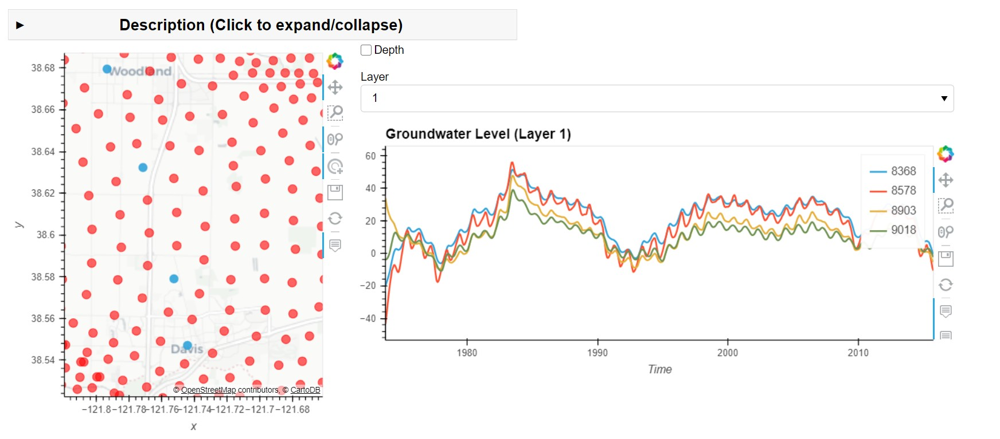

===============================
pyiwfm
===============================

-------------------------
Python utilities for IWFM
-------------------------

IWFM_ is a water resources model that includes a groundwater and stream flow routing model. 
These are a set of utilties to visualize the input and output for that model

.. _IWFM: https://water.ca.gov/Library/Modeling-and-Analysis/Modeling-Platforms/Integrated-Water-Flow-Model

------------
Installing
------------

Miniconda_ is required. After installing, clone this repository and change directory to it. That will 
allow the commands below to access the environment.yml file that is needed to setup the environment.

::

    conda config --set channel_priority strict
    conda env create -f environment.yml

The above command ensures that strict channel priority is used when creating the environment.
The environment will be named env_iwfm by default and will contain all the dependencies needed. 

Finally, clone this directory and change directory to it and install it as followsd

::

    conda activate env_iwfm
    pip install -e .

To confirm installation 

::

    conda activate env_iwfm 
    pyiwfm --version

.. _Miniconda: https://docs.conda.io/en/latest/miniconda.html

-----
Usage
-----

From the command line 

Ensure that environment is activated

::

    conda activate env_iwfm

To get help on commands and sub-commands

::

    pyiwfm -h
    usage: pyiwfm [-h] [-V] {trimesh-animator,head-obs-nodes,calib-head-obs-nodes,calib-rmse-map,head-nodes,nodes-gis,elements-gis} ...

    Python utilities for IWFM

    positional arguments:
    {trimesh-animator,head-obs-nodes,calib-head-obs-nodes,calib-rmse-map,head-nodes,nodes-gis,elements-gis}
                            sub-command help
        trimesh-animator    start trimesh animator
        head-obs-nodes      start groundwater heads observations vs nodes plotter
        calib-head-obs-nodes
                            start calibration groundwater heads observations vs nodes plotter
        calib-rmse-map      create calibration rmse (root mean squared) map
        head-nodes          dashboard to plot groundwater heads at nodes
        nodes-gis           plot nodes on a map & save to gis shapefile information
        elements-gis        plot elements on a map & save to gis shapefile information

    optional arguments:
    -h, --help            show this help message and exit
    -V, --version         Show the conda-prefix-replacement version number and exit.

Trimesh Animator
................

Trimesh Animator displays the groundwater head elevations/depths on a map

::

    pyiwfm trimesh-animator --help
    usage: pyiwfm trimesh-animator [-h] --elements-file ELEMENTS_FILE --nodes-file NODES_FILE --strat-file STRAT_FILE --head-file HEAD_FILE [--head-file-base HEAD_FILE_BASE]

    optional arguments:
    -h, --help            show this help message and exit
    --elements-file ELEMENTS_FILE
                            path to elements.dat file
    --nodes-file NODES_FILE
                            path to nodes.dat file
    --strat-file STRAT_FILE
                            path to stratigraphy.dat file
    --head-file HEAD_FILE
                            path to heads-all.out file
    --head-file-base HEAD_FILE_BASE
                            path to base heads-all.out file to display differences calculated as headfile - headfilebase

Groundwater Head Observations vs Node Plotter
.............................................

Groundwater Heads Observations vs Node Plotter displays the observation wells as dots on a map
and displays nearby model node heads along with observed values in a plot

The stations.csv and measurements.csv file can be downloaded from `CA DWR's Open Data Site <https://data.cnra.ca.gov/dataset/periodic-groundwater-level-measurements>`_

::

    pyiwfm head-obs-nodes --help
    usage: pyiwfm head-obs-nodes [-h] --elements-file ELEMENTS_FILE --nodes-file
                                NODES_FILE --strat-file STRAT_FILE --head-file
                                HEAD_FILE --stations-file STATIONS_FILE
                                --measurements-file MEASUREMENTS_FILE

    optional arguments:
    -h, --help            show this help message and exit
    --elements-file ELEMENTS_FILE
                            path to elements.dat file
    --nodes-file NODES_FILE
                            path to nodes.dat file
    --strat-file STRAT_FILE
                            path to stratigraphy.dat file
    --head-file HEAD_FILE
                            path to heads-all.out file
    --stations-file STATIONS_FILE
                            path to groundwater periodic stations file
    --measurements-file MEASUREMENTS_FILE
                            path to groundwater periodic measurements file

.. image:: docs/images/head-obs-nodes-snapshot.jpg

Groundwater Calibration Observation Well Heads vs Nodes
.......................................................

Calibration Groundwater Heads used in a calibration and stored in the geodatabase file. These are a 
curated subset of data available that qualifies to be used for calibration. The format in the geodatabase 
file is assumed to have a custom format

::

    pyiwfm calib-head-obs-nodes -h
    usage: pyiwfm calib-head-obs-nodes [-h] --elements-file ELEMENTS_FILE --nodes-file NODES_FILE --strat-file STRAT_FILE --head-file HEAD_FILE --calib-gdb-file CALIB_GDB_FILE

    optional arguments:
    -h, --help            show this help message and exit
    --elements-file ELEMENTS_FILE
                            path to elements.dat file
    --nodes-file NODES_FILE
                            path to nodes.dat file
    --strat-file STRAT_FILE
                            path to stratigraphy.dat file
    --head-file HEAD_FILE
                            path to heads-all.out file
    --calib-gdb-file CALIB_GDB_FILE
                            path to gdb file

Groundwater Calibration Observation - Model head root mean squared differences on a map
........................................................................................

An example of displaying and being able to save a standalone html interactive plot of
differences between calibration observations and nearby node heads as root mean squared errors (rmse).
The map displays the locations as dots with their colors based on the rmse values

::

    pyiwfm calib-rmse-map -h
    usage: pyiwfm calib-rmse-map [-h] --elements-file ELEMENTS_FILE --nodes-file NODES_FILE --strat-file STRAT_FILE --head-file HEAD_FILE --calib-gdb-file CALIB_GDB_FILE --cvprint-file
                                CVPRINT_FILE [--output-file OUTPUT_FILE]

    optional arguments:
    -h, --help            show this help message and exit
    --elements-file ELEMENTS_FILE
                            path to elements.dat file
    --nodes-file NODES_FILE
                            path to nodes.dat file
    --strat-file STRAT_FILE
                            path to stratigraphy.dat file
    --head-file HEAD_FILE
                            path to heads-all.out file
    --calib-gdb-file CALIB_GDB_FILE
                            path to gdb file
    --cvprint-file CVPRINT_FILE
                            path to cvprint file
    --output-file OUTPUT_FILE
                            html file to save rmse map to

.. image:: docs/test/calib-rmse-map.jpg

Groundwater head at nodes
.........................

The nodes are displayed as dots on the map and click on them shows a plot of the head

**Use Shift + Mouse Clicks to select multiple nodes and overlay their groundwater heads**

::

    pyiwfm trimesh-animator --help
    usage: pyiwfm trimesh-animator [-h] --elements-file ELEMENTS_FILE --nodes-file NODES_FILE --strat-file STRAT_FILE --head-file HEAD_FILE [--head-file-base HEAD_FILE_BASE]

    optional arguments:
    -h, --help            show this help message and exit
    --elements-file ELEMENTS_FILE
                            path to elements.dat file
    --nodes-file NODES_FILE
                            path to nodes.dat file
    --strat-file STRAT_FILE
                            path to stratigraphy.dat file
    --head-file HEAD_FILE
                            path to heads-all.out file
    --head-file-base HEAD_FILE_BASE
                            path to base heads-all.out file to display differences calculated as headfile - headfilebase

Nodes GIS Map and Export
........................

Display nodes on map and export to shapefiles

::

    pyiwfm nodes-gis -h
    usage: pyiwfm nodes-gis [-h] --nodes-file NODES_FILE [-o OUTPUT_DIR]

    optional arguments:
    -h, --help            show this help message and exit
    --nodes-file NODES_FILE
                            path to nodes.dat file
    -o OUTPUT_DIR, --output-dir OUTPUT_DIR
                            output directory to write out shapefile information

.. image:: docs/images/nodes-gis-snapshot.jpg

Elements GIS Map and Export
...........................

Display elements on map and export to shapefile

::

    pyiwfm elements-gis -h
    usage: pyiwfm elements-gis [-h] --nodes-file NODES_FILE --elements-file ELEMENTS_FILE [-o OUTPUT_DIR]

    optional arguments:
    -h, --help            show this help message and exit
    --nodes-file NODES_FILE
                            path to nodes.dat file
    --elements-file ELEMENTS_FILE
                            path to nodes.dat file
    -o OUTPUT_DIR, --output-dir OUTPUT_DIR
                            output directory to write out shapefile information

.. image:: docs/images/elements-gis-snapshot.jpg
